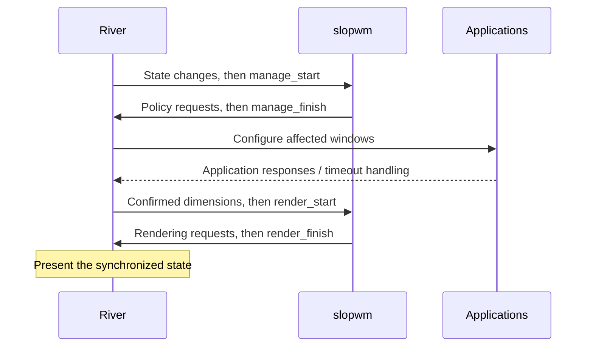

# Protocol notes

The detailed rules below are based on the bundled River v0.4.8
[window-management XML](../protocol/river-window-management-v1.xml)
and [XKB XML](../protocol/river-xkb-bindings-v1.xml), plus the
[input-management XML](../protocol/river-input-management-v1.xml).
Consult the [online management reference](https://isaacfreund.com/docs/wayland/river-window-management-v1/)
when updating the bundled specifications.

## Manage and render sequences

Accumulate incoming events in local state. Send policy requests when the
compositor reaches the corresponding sequence boundary, not immediately from
each metadata or binding callback.

| State | Examples | Allowed update interval | Applied by |
| --- | --- | --- | --- |
| Window management | Proposed dimensions, keyboard focus, fullscreen, enabled bindings | `manage_start` through `manage_finish` | `manage_finish`, with application synchronization afterward |
| Rendering | Node position, stacking, visibility, borders, clipping, decoration surfaces | A manage or render sequence, according to the global interface description | The next `render_finish` |

A manage sequence has at least one following render sequence. Render sequences
can also recur without a new manage sequence when application dimensions change.
Complete every sequence, including one with no desired changes. Sending a finish
request out of order is a protocol error.

The XML has a wording inconsistency: several individual rendering requests say
they are render-only, while the global description explicitly permits rendering
updates during manage sequences too. The demo positions and raises windows in
manage handlers. Follow the global sequencing rule; finalize geometry that
depends on confirmed content dimensions in `render_start`.

For a local configuration change, timer, or future IPC action, queue the intent
and call `manage_dirty()` to request a manage sequence. That request is a wakeup,
not permission to send policy changes immediately. Avoid repeated wakeups when
there is no work.

`reload-config` and SIGHUP validate the original config source in the event loop,
then stage a complete replacement and call `manage_dirty()`. Bindings are replaced
and keyboard settings refreshed at `manage_start`; render consumes the updated
borders. Failed parsing/I/O never stages a replacement. A nonblocking signal
self-pipe participates in the same poll loop as the Wayland socket, so idle
sessions can reload or shut down without periodic wakeups or extra roundtrips.

Animations keep target layout geometry separate from displayed geometry and
confirmed application dimensions. Manage proposes the final content dimensions;
render interpolates node positions, tile clipping, and borders with one shared
monotonic timestamp. Retargeting starts at the last displayed frame. Preview
placement uses the displayed tile. Dialogs render after their parents and track
their displayed allocation, including nested dialogs and viewport clamping;
their own content size changes apply immediately. Hidden workspaces, output
changes, and true fullscreen clear stale transitions.

The event loop polls with a deadline only while an animation is running. A due
frame queues one `manage_dirty()` and waits for its render sequence before
scheduling another; delayed application responses cannot accumulate frame
requests. Unchanged dimensions are never proposed again just to animate.
No per-frame roundtrip or new protocol/version requirement is introduced.
Idle and stopping sessions have no animation deadline.

Automatic pacing reads the current `wl_output.mode` refresh rate in millihertz
and ignores noncurrent advertised modes. A nanosecond deadline preserves
fractional refresh rates. Only outputs with running animations contribute; the
fastest sets the shared cadence, with a 60 Hz fallback for missing/zero refresh.
Output removal clears cached refresh metadata, and mode changes reschedule
pending timer deadlines. Numeric `frame_interval_ms` settings remain optional
overrides; `auto` is the default.

These timers pace management updates and do not synchronize them to vblank.
Wayland recommends surface frame callbacks for synchronized rendering; River's
bundled management interface has no equivalent callback for managed windows.
See the [core Wayland specification](https://wayland.freedesktop.org/docs/html/apa.html)
for the distinction between `wl_output.mode` refresh and `wl_surface.frame`.

## Objects and geometry

| Object | Purpose |
| --- | --- |
| `river_window_manager_v1` | Sequence boundaries, window/output/seat creation, lifecycle |
| `river_window_v1` | Content dimensions, metadata, application requests, window state |
| `river_node_v1` | Position and stacking of a window or shell surface |
| `river_shell_surface_v1` | Manager-owned UI, including the spawn-direction overlay |
| `river_output_v1` | A logical monitor area, including its position and dimensions |
| `river_seat_v1` | An input-device group with focus, interaction, and pointer operations |
| `river_xkb_bindings_v1` / `river_xkb_binding_v1` | Keyboard-binding creation and activation |

Call `get_node()` only once per window and keep the returned node. Set its
position and stacking explicitly; their initial values are not guaranteed.

A new window needs a dimensions proposal or fullscreen request, a returned
`dimensions` event, and a completed render sequence before it is displayed.
`propose_dimensions(0, 0)` lets the application choose its initial content size.
Negative proposals are invalid; reported dimensions are positive.

Store **requested dimensions separately from confirmed dimensions**. Applications
may choose another size, including terminal-cell rounding, and a response may
arrive in a later render sequence. Never treat a request as acknowledgement.

Positions and dimensions use logical coordinates. Output and node positions can
be negative. Window geometry describes content, excluding borders and decoration
surfaces. Account for those separately when computing tile rectangles. An
output represents a logical area, which can encompass mirrored or tiled physical
monitors; track its geometry events rather than guessing from physical modes.

Workspace visibility can use `hide()` / `show()`. Hidden windows still exist, so
workspace switching must also select appropriate keyboard focus.

## Spawn preview surface

slopwm creates its input-transparent overlay with `get_shell_surface()` on a
fresh `wl_surface`, before attaching or committing a buffer. These shell-surface
requests are available since management version 1 and require no new XML or
layer-shell support. The surface has an empty input region and is never given
keyboard focus. Its node is positioned explicitly and raised after window
render updates, so it can also appear over true fullscreen.

Preview pixels use immutable, premultiplied ARGB8888 `wl_shm` buffers backed by
anonymous files. The pool is destroyed after creating the buffer; the compositor
retains its backing storage, and `wl_buffer.release` destroys the buffer object.
The manager never rewrites a buffer still in use.

During a render sequence, `sync_next_commit()` is followed by the surface commit
before `render_finish()`. Attaching a null buffer removes the overlay in the same
render transaction that presents the newly inserted tile. Geometry and direction
changes create a new buffer; unchanged previews keep their existing pixels.

## Focus, bindings, and pointer operations

Keyboard focus belongs to a seat: use `focus_window()` or `clear_focus()` in a
manage sequence. Focus and stacking are separate operations. A
`window_interaction` can represent pointer, touch, or tablet activity; it is more
appropriate for click-to-focus policy than assuming that hover implies a click.

XKB bindings use **keysyms and modifier flags**, not Linux keycodes. Configure
and enable each binding during a manage sequence. Binding press/release events
precede `manage_start`; remember the action until that boundary. Triggering keys
are intercepted by the compositor. Respond promptly: the server may defer
further input processing until the manage sequence finishes.

Pointer bindings use Linux button codes: `BTN_LEFT = 0x110`,
`BTN_RIGHT = 0x111`. The demo uses `Modifiers::Mod4` for Super.

Keyboard repeat is configured through `river_input_manager_v1`, independently
of XKB bindings. Device creation and type events accumulate local state;
keyboard types request a manage sequence with `manage_dirty()`. At `manage_start`,
slopwm sends `set_repeat_info(rate, delay)` once per new keyboard, using the same
global configuration on every seat. A successful reload with changed repeat
settings also marks existing keyboards for configuration. Devices connected
later follow the same path. Non-keyboard devices receive no repeat requests.
Removal discards any pending configuration and explicitly destroys the device
proxy.

Input-device events do not follow the window-management sequence boundaries;
the explicit wakeup ensures a new keyboard is configured even while idle.
`set_repeat_info` is available since input-management version 1; version 1 does
not send `done`, so configuration depends only on the immutable device type.
The input manager is destroyed only after its `finished` event.

## Layer shell

Layer-shell clients (wallpapers such as `awww`/`swww` or `swaybg`, bars,
launchers) only map their surfaces while the window manager binds
`river_layer_shell_v1`. Without that binding River closes layer surfaces
immediately, so wallpaper daemons end up with no outputs at all.

At `manage_start`, slopwm creates one `river_layer_shell_output_v1` per live
output and one `river_layer_shell_seat_v1` per live seat, then marks the
active monitor (falling back to the first ordered output) with `set_default()`
for layer surfaces that request no explicit output. Removed outputs and seats
destroy their layer objects alongside the River objects.

`non_exclusive_area` is stored separately from physical output geometry.
The work area intersects its vertical extent with the monitor; horizontal
geometry stays physical to preserve the 98% scrolling area and 1% peeks.
Normal tiles, stacks, dialogs, soft fullscreen, and previews use the work area;
true fullscreen uses River's complete output. Fully reserved vertical space
hides ordinary tiles until space returns.

`focus_exclusive` suppresses window-manager focus requests until exclusivity
ends. `focus_non_exclusive` lets a launcher keep focus until explicit navigation,
a click, or a new selected window changes the selected tile. These events
invalidate the cached seat focus so `focus_none` restores the selected window
even when its identity has not changed. Layer focus and session locking suppress
focused border colors. Keyboard bindings are disabled during locked manage
sequences and re-enabled after unlocking; pending presses are also discarded. The
layer-shell global is optional, so older compositors without it still run the
manager, just without mappable layer surfaces.

For interactive movement or resizing:

1. Save the original geometry and start `op_start_pointer()` during manage.
2. Treat `op_delta(dx, dy)` as cumulative motion from that origin, not as an
   increment to add repeatedly.
3. For resize, propose dimensions during manage; use confirmed dimensions during
   render to preserve the opposite edge when resizing from the top or left.
4. On `op_release`, explicitly call `op_end()` during manage. Bracket resizing
   with `inform_resize_start()` / `inform_resize_end()`.
5. Cancel an operation whose window closes or whose seat disappears, respecting
   the remaining objects' lifetimes.

## Transient windows

Transient windows retain their parent metadata separately from their allocation.
They are excluded from tiled column rows and follow their root parent's output,
workspace, and column. An initial `propose_dimensions(0, 0)` lets the application
choose its natural size. Confirmed dimensions update that preference separately
from subsequent constrained proposals. Render-only dimension changes recenter
dialogs without sending management requests from render. Parent-before-child
layout and node ordering also handle nested dialogs and parents arriving later
in the same event batch. Closed parents are resolved before destroying proxies;
focus returns to a live ancestor and surviving orphans become tiles.

## Fullscreen and capabilities

`fullscreen(output)` controls compositor geometry and fullscreen rendering.
`inform_fullscreen()` only communicates the state to the application. Use both
when implementing conventional fullscreen; similarly inform the application
when leaving it.

After `exit_fullscreen()`, restore dimensions and position. The specification
recommends proposing dimensions and setting position in the same manage
sequence for a synchronized transition. Output removal also ends compositor
fullscreen on that output, so reconcile slopwm's stored state then.

Set each new window's capabilities to the actions slopwm actually supports.
The default advertises all capabilities, even if the manager ignores maximize,
fullscreen, or minimize requests. Maximized-state notification also leaves
geometry management to us.

## Lifecycle

Only one management client may be active. `unavailable` requires a clear startup
failure and object cleanup; it can indicate another manager or other compositor
policy, so avoid claiming one cause with certainty.

`close()` asks the application to close; a save dialog or refusal is possible.
Wait for `closed` before removing the logical window. Clear focused, hovered,
interaction, and operation references to it, and explicitly destroy protocol
objects when their lifetimes permit. Output and seat `removed` events likewise
require cleanup. Dropping a Rust proxy is not a substitute for sending a
protocol destructor.

To stop gracefully, `quit`, SIGTERM, and SIGINT send `stop()` to both the window
and input managers. Continue completing any in-flight manage/render sequences
until `finished`, then destroy each manager's dependent objects and the manager
itself. The two acknowledgements may arrive in either order. Flush destructors
before leaving the event loop. `unavailable` follows the same cleanup path with
an error result; startup failures stop globals already bound. `exit_session()` is a
different action that disconnects the entire session; reserve it for an explicit
user command. Track session lock events when deciding which bindings stay active.

## Compatibility

| Interface | Original demo XML / binding | slopwm bundled maximum | slopwm negotiated range |
| --- | --- | --- | --- |
| `river_window_manager_v1` | 4 / 4 | 5 | 4–5 |
| `river_xkb_bindings_v1` | 2 / 1 | 3 | 1–3 |
| `river_input_manager_v1` | — | 2 | 1–2 |
| `river_layer_shell_v1` | — | 1 | 1 (optional) |

The bundled maximums match the documentation checked on 2026-10-06 in the
[management](https://isaacfreund.com/docs/wayland/river-window-management-v1/),
[XKB](https://isaacfreund.com/docs/wayland/river-xkb-bindings-v1/), and
[input-management](https://isaacfreund.com/docs/wayland/river-input-management-v1/)
references.
They come from the tagged **River v0.4.8 release**, commit
`c4b5f706314555f4846e25b8d3635631387b3fdd`; see
[protocol provenance](../protocol/README.md). The installed compositor still
determines which version can actually be bound. `exit_session()` needs
management interface version 4.

slopwm preserves the demo's minimum requirements and binds the lesser of the
advertised and generated versions. Input management version 1 or newer is also
required for keyboard repeat settings. Layer shell version 1 is optional:
without it the manager still runs, but layer surfaces cannot map. The
imported handlers explicitly ignore the version-5 window/output
capture-session events; capture UI remains future work.
The generated XKB seat interface includes version-3 modifier watching, but the
baseline does not create that optional object. Gate any future newer requests
by the negotiated version. Bundling newer XML alone does not enable features
when binding an older version.
