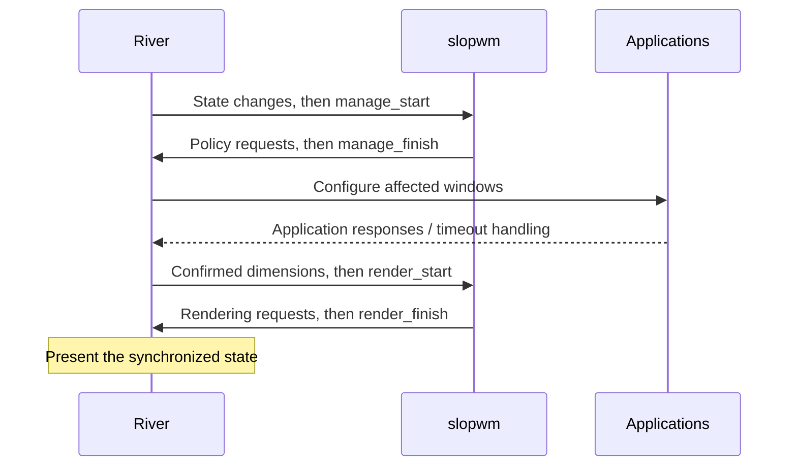

# Protocol notes

The detailed rules below are based on the demo's
[window-management XML](/home/fernando/projects/river/tinyrwm/rust/protocol/river-window-management-v1.xml)
and [XKB XML](/home/fernando/projects/river/tinyrwm/rust/protocol/river-xkb-bindings-v1.xml).
Consult the [online management reference](https://isaacfreund.com/docs/wayland/river-window-management-v1/)
when updating the bundled specifications.

## Manage and render sequences

Accumulate incoming events in local state. Send policy requests when the
compositor reaches the corresponding sequence boundary, not immediately from
each metadata or binding callback.

| State | Examples | Allowed update interval | Applied by |
| --- | --- | --- | --- |
| Window management | Proposed dimensions, keyboard focus, fullscreen, enabled bindings | `manage_start` through `manage_finish` | `manage_finish`, with application synchronization afterward |
| Rendering | Node position, stacking, visibility, borders, clipping, decoration surfaces | A manage or render sequence, according to the global interface description | The next `render_finish` |

A manage sequence has at least one following render sequence. Render sequences
can also recur without a new manage sequence when application dimensions change.
Complete every sequence, including one with no desired changes. Sending a finish
request out of order is a protocol error.

The XML has a wording inconsistency: several individual rendering requests say
they are render-only, while the global description explicitly permits rendering
updates during manage sequences too. The demo positions and raises windows in
manage handlers. Follow the global sequencing rule; finalize geometry that
depends on confirmed content dimensions in `render_start`.

For a local configuration change, timer, or future IPC action, queue the intent
and call `manage_dirty()` to request a manage sequence. That request is a wakeup,
not permission to send policy changes immediately. Avoid repeated wakeups when
there is no work.

## Objects and geometry

| Object | Purpose |
| --- | --- |
| `river_window_manager_v1` | Sequence boundaries, window/output/seat creation, lifecycle |
| `river_window_v1` | Content dimensions, metadata, application requests, window state |
| `river_node_v1` | Position and stacking of a window or shell surface |
| `river_output_v1` | A logical monitor area, including its position and dimensions |
| `river_seat_v1` | An input-device group with focus, interaction, and pointer operations |
| `river_xkb_bindings_v1` / `river_xkb_binding_v1` | Keyboard-binding creation and activation |

Call `get_node()` only once per window and keep the returned node. Set its
position and stacking explicitly; their initial values are not guaranteed.

A new window needs a dimensions proposal or fullscreen request, a returned
`dimensions` event, and a completed render sequence before it is displayed.
`propose_dimensions(0, 0)` lets the application choose its initial content size.
Negative proposals are invalid; reported dimensions are positive.

Store **requested dimensions separately from confirmed dimensions**. Applications
may choose another size, including terminal-cell rounding, and a response may
arrive in a later render sequence. Never treat a request as acknowledgement.

Positions and dimensions use logical coordinates. Output and node positions can
be negative. Window geometry describes content, excluding borders and decoration
surfaces. Account for those separately when computing tile rectangles. An
output represents a logical area, which can encompass mirrored or tiled physical
monitors; track its geometry events rather than guessing from physical modes.

Workspace visibility can use `hide()` / `show()`. Hidden windows still exist, so
workspace switching must also select appropriate keyboard focus.

## Focus, bindings, and pointer operations

Keyboard focus belongs to a seat: use `focus_window()` or `clear_focus()` in a
manage sequence. Focus and stacking are separate operations. A
`window_interaction` can represent pointer, touch, or tablet activity; it is more
appropriate for click-to-focus policy than assuming that hover implies a click.

XKB bindings use **keysyms and modifier flags**, not Linux keycodes. Configure
and enable each binding during a manage sequence. Binding press/release events
precede `manage_start`; remember the action until that boundary. Triggering keys
are intercepted by the compositor. Respond promptly: the server may defer
further input processing until the manage sequence finishes.

Pointer bindings use Linux button codes: `BTN_LEFT = 0x110`,
`BTN_RIGHT = 0x111`. The demo uses `Modifiers::Mod4` for Super.

For interactive movement or resizing:

1. Save the original geometry and start `op_start_pointer()` during manage.
2. Treat `op_delta(dx, dy)` as cumulative motion from that origin, not as an
   increment to add repeatedly.
3. For resize, propose dimensions during manage; use confirmed dimensions during
   render to preserve the opposite edge when resizing from the top or left.
4. On `op_release`, explicitly call `op_end()` during manage. Bracket resizing
   with `inform_resize_start()` / `inform_resize_end()`.
5. Cancel an operation whose window closes or whose seat disappears, respecting
   the remaining objects' lifetimes.

## Fullscreen and capabilities

`fullscreen(output)` controls compositor geometry and fullscreen rendering.
`inform_fullscreen()` only communicates the state to the application. Use both
when implementing conventional fullscreen; similarly inform the application
when leaving it.

After `exit_fullscreen()`, restore dimensions and position. The specification
recommends proposing dimensions and setting position in the same manage
sequence for a synchronized transition. Output removal also ends compositor
fullscreen on that output, so reconcile slopwm's stored state then.

Set each new window's capabilities to the actions slopwm actually supports.
The default advertises all capabilities, even if the manager ignores maximize,
fullscreen, or minimize requests. Maximized-state notification also leaves
geometry management to us.

## Lifecycle

Only one management client may be active. `unavailable` requires a clear startup
failure and object cleanup; it can indicate another manager or other compositor
policy, so avoid claiming one cause with certainty.

`close()` asks the application to close; a save dialog or refusal is possible.
Wait for `closed` before removing the logical window. Clear focused, hovered,
interaction, and operation references to it, and explicitly destroy protocol
objects when their lifetimes permit. Output and seat `removed` events likewise
require cleanup. Dropping a Rust proxy is not a substitute for sending a
protocol destructor.

To stop gracefully: send manager `stop()`, continue dispatching until `finished`,
then destroy the manager and its dependent objects. `exit_session()` is a
different action that disconnects the entire session; reserve it for an explicit
user command. Track session lock events when deciding which bindings stay active.

## Compatibility

| Interface | Demo XML maximum | Demo actually binds | Online reference observed |
| --- | --- | --- | --- |
| `river_window_manager_v1` | 4 | 4; rejects a server below 4 | 5 |
| `river_xkb_bindings_v1` | 2 | 1; rejects a server below 1 | 3 |

The online values were checked on 2026-10-06 in the
[management](https://isaacfreund.com/docs/wayland/river-window-management-v1/) and
[XKB](https://isaacfreund.com/docs/wayland/river-xkb-bindings-v1/) references.
They describe documentation, not the version installed locally. The demo's
`exit_session()` needs management interface version 4.

For the initial implementation, use the demo's explicit 4/1 binding requirements.
If later supporting older servers, bind at most the lesser of the advertised
version and the generated version, enforce a minimum for required features,
and gate every newer request. Bundling newer XML alone does not enable features
when binding an older version.
